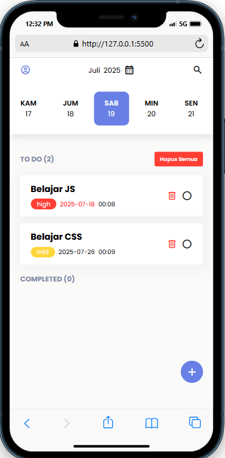
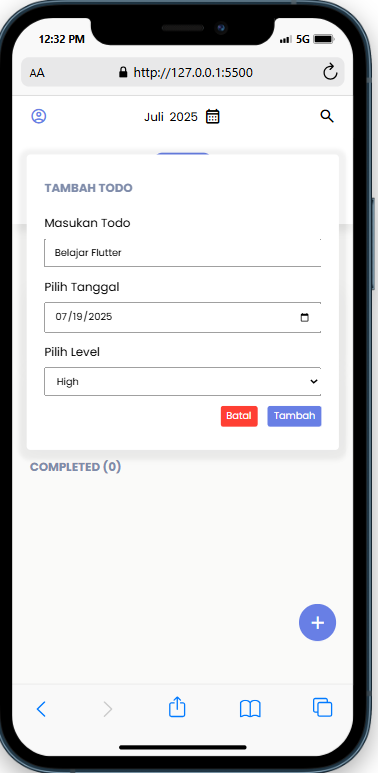
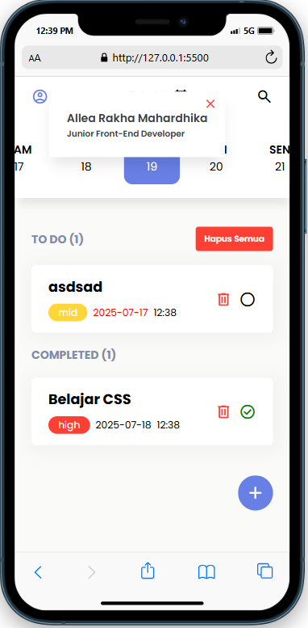

# TodoApp

ToDoApp adalah aplikasi manajemen tugas yang dirancang untuk membantu pengguna dalam mengatur aktivitas harian secara lebih terstruktur dan efisien. Aplikasi ini dilengkapi dengan berbagai komponen utama yang saling mendukung dalam pencatatan, pengelompokan, hingga penyelesaian tugas.

## Features

- Profile : Menampilkan informasi pengguna, seperti nama dan jabatan.

- Time : Menunjukkan informasi waktu berupa hari dan tanggal secara real-time.

- Search todo : Berfungsi untuk mencari todo pada section todo maupun Compeleted.

- Input Todo : Tempat bagi pengguna untuk menuliskan deskripsi tugas yang ingin dikerjakan.

- Input Date : Tempat bagi pengguna untuk memilih tanggal tugas yang akan dikerjakan.

- Level Prioritas : Mengategorikan tingkat urgensi tugas menjadi tiga: Low, Medium, dan High.

- Button Submit : Berfungsi untuk menyimpan tugas yang telah dituliskan di Text Area.

- Kolom Centang : Digunakan untuk menandai status tugas dalam daftar To Do apakah sudah selesai atau belum.

- To Do Section : Berisi daftar tugas yang sedang atau akan dikerjakan oleh pengguna.

- Compeleted Section : Menampilkan tugas-tugas yang telah diselesaikan dari daftar To Do.

- Button Delete : Digunakan untuk menghapus seluruh daftar tugas yang telah dibuat.

- Overdue : Tanggal yang sudah overdue/late makan akan berubah menjadi merah.

## Screenshots

 

## Tech Stack

**tools:** HTML, CSS, Javascript

**Database:** Web Storage

**add-on:** [fontawesome](https://fontawesome.com/icons), [sweetalert2](https://sweetalert2.github.io/) 

## Authors

- [@rakhaallea](https://github.com/rakhaallea)

